# Seven Card Stud Poker Solver - Implementing Deep Reinforcement Learning Algorithms to Solve a Limit Poker Variant

## Introduction
Code for a Seven-card stud poker solver. This is a Poker Solver based on the [ESCHER algorithm by McAleer et al.](https://arxiv.org/pdf/2206.04122)

There is the algorithm, "escher.py", which generates policies, and there is a visualization tool "visualization.py" which creates range charts where you can view probability distributions for a range of hands. I've also attached the game environment "seven_card_stud.py" which should be complacent with the rest of the OpenSpiel library.

_This section is an archive of my notes, my thoughts, etc.. Scroll to the bottom for some example ranges I've generated_<br>
_See [HOWTO.md](HOWTO.md) for setup instructions._

## My Questions Going In
When starting this project I had a few questions going in that I wanted to try to resolve, and see how the answers compared to what the current consensus of professional Stud play looked like:

1) __*Are players not completing often enough?*__<br>
    In Stud, the player with the lowest up-card has to post the blind, but unlike Hold'em, they have a choice: They can either "bring it in" for the lowest best size, or "complete" for the small bet. In Stud, its a general rule that you should almost always choose to bring-in instead of completing, since the fact that their up-card is the lowest already decreases the value of their hand. I don't disagree with this conclusion, but what I wondered is if there exist more opportunities to complete than previously thought, especially when the bring-in has a higher-than-usual up-card.

    I know that the results for a game of heads-up don't necessarily generalize well to a full-ring game, but even so, I was curious if there were any insights to be gleaned from heads-up play, even if they were marginal plays.

2) __*Are players overcalling on later streets?*__<br>
    One of the first concepts you'll learn about in Poker is the notion of "Pot-Odds". Essentially, you try to quantify the expected value of calling or placing a bet by measuring the ratio between the chips wagered and the current size of the pot. In limit games, you are getting increasingly better pots odds on further streets since the amount you can bet is fixed. This can lead to scenarios like calling a $100 bet to win $1200. On paper, you have pot odds of 12/1, which means you only need to win about ~7.5% of the time to break-even on your bet. On paper this sounds like a great deal, but often times players will make these calls knowing they're essentially drawing dead. A fact that becomes even more obvious in Stud given half of your hand is exposed.

    I wanted to examine what scenarios a poker bot would choose to chase (continue calling) and which scenarios it would give up, and how these decisions would compare to a human player.

3) __*Are players bluffing enough?*__<br>
    Bluffing is the cornerstone of poker, and is what separates it from all other card games. Imperfect information games force you to make decisions without the full picture, requiring you to fill in the blanks and come to the best conclusion. However, for a game like Stud, there's much less to hide, four cards of information, in fact, are given to you for free. It may seem like Stud is an impossible game to bluff in, but there are scenarios in which it can be done, and it requires a level of finesse and mathematics that I think a poker bot could find.

    Most of my knowledge of Stud play has come from watching tapes of the WSOP, so I may very well be dealing with a biased sample here, but what I wanted to discover was how a poker bot would bluff, what hands were "bluffable", was bluffing done earlier or later, and how did that compare to human play?

These are easy questions to ask, but harder to answer. Most of my analysis on the generated policies was done in comparison to professional play, by examining how poker professionals played in spots and how my agent would have played their hands in a counterfactual sense. I took notable hands from past stud events where the hand was heads up by fourth street to better compare spots, and I made note of any dead cards that may impact play.

_*A minor sidenote_ I trained my agent specifically for heads up Seven Card Stud, which means some strategies, especially on earlier streets, may not be as applicable to a full-ring game. Often times, heads-up strategies can be adapted to games of more than two players, but for a game like stud where the removal/pruning of certain card combinations is more pronounced, I think an agent would need nuance than you'd need for a game like Texas Hold'em.

## Techniques, Algorithms, and Prior Work

Here's where the math begins. Some authors use different notation for different mathematical objects/concepts, so I tried to keep things relatively standardized when possible

### Extensive Games

An _n_-player extensive form game has the following properties: <br>
* A finite set of _n_ players
* A rooted tree, called the game tree
* each leaf node of this tree (called terminal nodes) has a _n_-tuple of payoffs, meaning there is one payoff per player at the end of every possible play, which can be positive, negative or 0.
* A partition of the non-terminal nodes of the game tree into _n_+1 subsets, one for each player, and with a special subset for a fictitious player called "Chance".
  * Each player's subset of nodes is referred to as the "nodes of the player". If a game has no chance nodes, it is a perfect information game (such as Chess or Go).
* Each node of the Chance player has a probability distribution over its outgoing edges
* Each set of nodes of a player is further partitioned into information sets, where certain states becomes indistinguishable from the perspective of a player due to a lack of information.
* The complete description of the game (including the properties above) is common knowledge amongst the players.

A player's _i_'s strategy, usually denoted by  *σ<sub>i</sub>* is a function that assigns a distribution over the set of actions at each information set. A strategy profile is a tuple of strategies for a set of players (*σ<sub>1</sub>*, *σ<sub>2</sub>*, ... , *σ<sub>n</sub>*), and the strategies of the opponent player's with respect to a player _i_ is denoted *σ<sub>-i</sub>*.

If players play by the strategy profile *σ*, then the probability of reaching any given history, denoted *π<sup>σ</sup>(h)*, is just equal to the product of the probabilities of each action being chosen by each player (including the chance player):

 <br>
The overall value of a strategy profile to a player *i* is then the sum of all expected payoffs at all terminal nodes, multiplied by the probability of reaching that node under the current strategy profile:

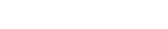 <br>
### Nash Equilibrium

*Nash Equilibrium* is the state in which neither player can change how they play and receive a higher value for their strategy. For example, if two people play Rock-Paper-Scissors in a Nash equilibrium, where we throw rock, paper and scissors with equal likelihood, neither person can start throwing any option more often and expect to win more often. This can be demonstrated by looking at a payoff matrix

INSERT PICTURE HERE

Starting at the Nash equilibrium (1/3 probability for each action) we can see that regardless of how a player could choose to change their strategy, any gain in reward is offset by an equal loss.

More formally, a Nash equilibrium a strategy profile *σ* where the following inequalities hold:

&nbsp;&nbsp;&nbsp;&nbsp;&nbsp;&nbsp;&nbsp;&nbsp;&nbsp;&nbsp; <br>
For more complex games, its more likely that a computer will only be able to find an epsilon-Nash equilibrium. That is, a player cannot improve his strategy by more than epsilon from the current equilibrium

&nbsp;&nbsp;&nbsp;&nbsp;&nbsp;&nbsp;&nbsp;&nbsp;&nbsp;&nbsp; <br>

### Regret

Regret is a concept that comes from online learning and has found a powerful use-case in learning equilibrium strategies.

To help understand regret, imagine you repeatedly play an extensive game. Let *σ<sub>i</sub><sup>t</sup>* be the strategy that player *i* used on round *t* in a game. The average overall regret that player *i* has at time *T* is:

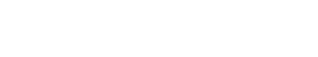<br>
Next, we define *σ̅<sub>i</sub><sup>t</sup>* to be the average strategy of player *i* from time 1 to time *T*. In particular, for each information set *I ∈ ℐ_i*, and for each action *a ∈ A(I)*, define the function:

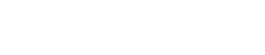<br>
There is a special theorem that connects the concept of regret to a Nash equilibrium

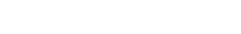<br>
An algorithm that selects *σ<sub>i</sub><sup>t</sup>* for player *i* is said to be regret minimizing if player *i*'s average overall regret tends to 0 as *t* goes to infinity. We can take advantage of this by using regret minimization to compute an approximate Nash equilibrium instead of having to solve for one directly.

### Counterfactual Regret Minimization [(Zinkevich et al., 2007)](https://poker.cs.ualberta.ca/publications/NIPS07-cfr.pdf)

What we can do is decompose our overall regret into a set of additive regret terms, and minimize them independently. This calls for a new concept, called *counterfactual regret*, which is defined on an information set.

Suppose we are at a specific information set _I_. Define _u<sub>i</sub>(σ, h)_ as the expected utility given history _h_  is reached and that both players are using strategy _σ_. The counterfactual utility _u<sub>i</sub>(σ, I)_ is the expected utility given that an information set _I_ is reached (instead of a specific history), given all players except player _i_ play by _σ_. Then, if _π<sup>σ</sup>(h,h')_ is the probability of moving from _h_ to _h'_, we can define counterfactual utility as follows:

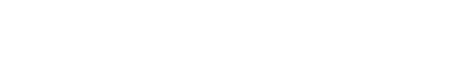<br>
With counterfactual utility defined, we can finally define immediate counterfactual regret. For each _a \in A(I)_, define _σ|<sub>I→a</sub>_ to be a strategy profile where player _i_ will always choose action _a_ when in information set _I_, all else held equal. We have that the immediate counterfactual regret _R<sub>i,imm</sub><sup>T</sup>(I)_ is:

<br>
This can be thought of as the player's regret in their decisions for a given information set, defined in terms of counterfactual utility. The regret is also weighted by a counterfactual probability that measures how likely infoset _I_ would have been reached had the player specifically sought out to do so. Oftentimes, we only really care if regret is positive, so let _R<sub>i,imm</sub><sup>T,+</sup>(I) = max(R<sub>i,imm</sub><sup>T</sup>(I),0)_.

Zinkevich found that by minimizing immediate counterfactual regret, you actually minimize overall regret. This is super important, because this means that we can essentially find approximate Nash equilibria by only minimizing immediate counterfactual regrets, which tends to be much easier to do. In the case of immediate counterfactual regrets, all we really need to adjust is _σ<sub>i</sub>(I)_, or the strategy that each player chooses at a given information set.

With this in mind:

<br>
The strategy for the next iteration _T+1_ becomes:

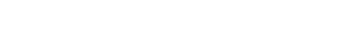<br>
Actions are selected in proportion to the amount of strictly positive counterfactual regret they possess (by how much we regret not choosing that action). If no actions have regret, then you just select an action uniformly at random.

With this in mind, we have the following theorem:

<br>
This means that by using the last equation above, you can compute a nash equilibrium (or approximation of one) through self-play.

### Monte-Carlo CFR [(Lanctot et al., 2009)](https://poker.cs.ualberta.ca/publications/NIPS07-cfr.pdf)

One of the main issues that plagues CFR in its vanilla form is that it requires the entire game tree to be traversed upon each iteration. This becomes increasingly difficult for more complex games, and outright impossible for most poker variants (excluding Kuhn Poker and Leduc Hold'em). There are abstractions that can help, such as bucketing certain game states and treating them as identical for the purpose of reducing the number of infosets to be covered, but abstraction is not easily generalizable, and requires a deep understanding of the game's mechanics. Lanctot proposes a more general framework for sampling in CFR, which serves to sample game histories, often referred to as trajectories, instead of trying to minimize regret on the entire game tree at once, which is dubbed Monte-Carlo Counterfactual Regret Minimization, or MCCFR.

MCCFR's approahc is to avoid traversing the entire game tree at once while also having the immediate counterfactual regrets be unchanged in expectation. This is done by restricting the terminal histories considered on each iteration. Consider the set _𝓠={Q<sub>1</sub>,...,Q<sub>r</sub>}_ which is a set of subsets of the terminal states _Z_ such that their union spans the set _Z_. Each of these subsets _Q<sub>j</sub>_ is referred to as a block. On each iteration of MCCFR, instead of sampling the whole tree, you sample one of these blocks, and only consider the terminal histories in that block. Let _q<sub>j</sub>_ be the probability of selecting the block _Q<sub>j</sub>_ for the current iteration. Also, let _q(z)_ be the probability of considering a specific terminal history _z_ on the current iteration (with the current block selected). We have:

<br>
The sampled counterfactual value when updating block _j_ is:

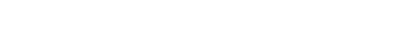<br>
Selecting a particular set _𝓠_ along with sampling probabilities makes for a complete sample-based CFR algorithm. And, if you pick _𝓠={Z}_, you'd find that the sampled counterfactual value is equal to the regular counterfactual value, which just gives you plain CFR.

A key result of this sampling method is that the expected value of the sampled counterfactual value is just the immediate counterfactual value:

<br>
With this in mind, we can think of MCCFR as the following sequence of steps:
1. Sample a block from _𝓠_
2. Compute the sampled immediate counterfactual regrets
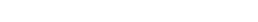
3. Accumulate the regrets, and then apply regret-matching to the accumulated regrets

For MCCFR there are two particular methods that are used, which dictate how you select _𝓠_, outcome-sampling, and external-sampling.

#### Outcome Sampling

Outcome-sampling chooses _𝓠_ so that each block contains a single terminal history. That means you are only updating the information sets that you would visit on the way to that specific terminal history.

To more rigorously define the sampling probabilities _q<sub>j</sub>_ we have to specify a distribution over the terminal histories. We call this distribution a "sampling profile" and denote it by _σ'_, so that _q(z)=π<sup>σ<sup>'</sup></sup>_.

After selecting a terminal history _z_ with _σ'_, the history is traversed forward to compute each player's probability of playing and reaching each prefix of the history (denoted π<sup>σ</sup><sub>i</sub>(h)). Then, it is traversed backward to compute the probability of playing the unselected actions of the history (denoted π<sup>σ</sup><sub>i</sub>(h, z)). On the backward traversal, the sampled counterfactual regrets at each visited information set are computed and added to the the total regret.

<br>
One advantage of OS-MCCFR is that if you sample histories according to the opponents policy, then you no longer need explicit knowledge of their policy. This is because _σ<sub>-i</sub>' = σ<sub>-i</sub>_ so the terms cancel out in the _w<sub>I</sub>_ component of our equation above. This means that we can engage in online learning, instead of just relying on a static dataset.

#### External Sampling

External-sampling is different from outcome-sampling in that ES-MCCFR samples only actions that are external to the player (decisions made by opponent or by chance). We have a block _Q<sub>τ</sub>∈𝓠_ for each pure strategy of the opponent and chance. That is, for each information set _I∈ℐ<sub>c</sub>∪ℐ<sub>N\\{i}</sub>_ is mapped deterministically to an action A(I). The probabilities of each block is assigned based on the distributions _f<sub>c</sub>_ and _σ<sub>-i</sub>_ so that the probability of sampling block _Q<sub>τ</sub>_ is:

<br>
Then, the block _Q<sub>τ</sub>_ contains all terminal histories _z_ consistent with _τ_. The important part is that by partitioning this way, our block probabilities result in _q(z)=π<sup>σ</sup><sub>-i</sub>(z)_. The algorithm alternates between players, and for each player does a post-order depth-first traversal of the game tree (it goes to a terminal node and then works its way backward), and samples actions at each history _h_ where _P(h)≠i_. These sampled actions are then stored to ensure that the same actions are sampled at all _h_ in the same information set. For each visited information set, the sampled counterfactual regrest are computed:

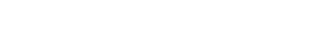<br>
In practice, external-sampling tends to outperform outcome-sampling as was demonstrated in experiments performed by Lanctot. This makes sense considering that external-sampling has a tighter bound on average overall regret than outcome-sampling (see Theorems 4 and 5).

### Deep CFR [(Brown et al., 2019)](https://arxiv.org/pdf/1811.00164)

Deep CFR is the deep learning implementation of CFR. Deep CFR approximates the behavior of CFR without actually calculating or accumulating regrets at each infoset. It does this by generalizing across similar infosets using function approximation. In practice, Deep CFR can be implemented using either external or outcome-sampling, however in Brown's implementation, external-sampling was used so that samples in a given iteration are assigned equal weight. External-sampling also has the benefit of reducing variance by exploring all actions.

Deep CFR uses two neural networks to approximate CFR. A value network, which tries to estimate instantaneous regrets to be used for regret matching, and a policy network, which approximates the average strategy of the agent. Its important that the network approximates the average strategy, because it is the average strategy that converges to a Nash equilibrium, not the most recent policy.

In order to train these networks, two memory buffers are used to hold past training data. The regret buffer stores samples of instantaneous regrets from CFR iterations which are then used to train the value network. The policy buffer holds probability vectors for given infosets. Each time a player's infoset is traversed during an opponents game tree traversal, the probability vector used to choose an action is added to the memory buffer.

In practice, Deep CFR has been shown to converge faster than MCCFR with abstractions, as well as neural-fictious self play (NFSP). Brown tested the models on a version of poker called Flop Hold'em, which is identical to Texas Hold'em except there are no betting rounds for the turn or river.

Deep CFR and other neural methods were some of the first algorithms that could feasibly be applied to imperfect-information games with large state and action spaces. Deep CFR itself was notable in being the first non-tabular CFR variant to be successful in large games like Poker.

While Deep CFR overcame huge hurdles, one of the main drawbacks was variance. When sampling, MCCFR and Deep CFR weights utility estimates by a reach term, which measures the probability that a state is reached. For games with large state and action spaces, this reach term becomes extremely small, which results in estimates of extremely large magnitude, and consequently, high levels of variance. For Deep CFR, this results in a training procedure that tends to be unstable.

### DREAM [(Steinberger et al., 2020)](https://arxiv.org/pdf/2006.10410)

DREAM is an extension of Deep CFR which attempts to tackle this variance issue. Deep CFR's base implementation uses external-sampling over outcome-sampling because of its lower variance, but this also means that Deep CFR needs a perfect simulatior of the game (it needs to be able to explore alternative actions at infostate instead of just one action per infostate). DREAM chooses to use an outcome-sampling approach instead. At face-value, this just increases variance and exacerbates the existing problem; to combat this, DREAM uses a neural form of history baselines, which try to estimate state values in order to reduce variance. Here's how it works:

Baselines, in this context, come from a paper by [Davis et al.](https://arxiv.org/pdf/1907.09633). They look at OS-MCCFR, which DREAM is based off of. For each iteration, one terminal history is sampled according to some fixed sampling strategy _q<sup>t</sup>_. Then, for each prefix of this terminal history, sampled utility is recursively calculated as follows:

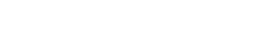<br>
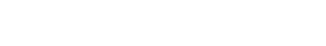<br>

For our baseline, assume there exists a function _b<sup>t</sup>:H x A -> ℝ_. That approximates _u((ha)|σ<sup>t</sup>)_ to an extent. Next, define baseline-corrected sampled utility as:

<br>
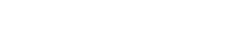<br>

These definitions are very similar to their normal sampled counterparts, with a key difference. For _u<sub>b</sub>_ we subtract our $b^t$ function from our target, weighting it by our indicator term, and then add back the baseline unweighted.

The reason we can use this new definition for sampled utilities is because of control variates. We can lower the variance of  by subtracting 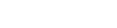 and adding back its known expectation _b<sup>t</sup>(h,a)_.
This gives us an unbiased estimate of utility with the added benefit of lower variance.

The challenge then becomes to choose a good baseline function _b<sup>t</sup>_. Steinberger found that by picking _b<sup>t</sup>_ such that _b<sup>t</sup>(h,a) ≈ u((ha)|σ<sup>t</sup>)_, variance is minimized.

In practice, there are a few ways this can be achieved.
1. No baseline - set _b<sup>t</sup>(h,a) = 0_ and DREAM operates identically to MCCFR. No baseline at all still technically counts as a baseline, but underperforms in most circumstances.
2. Static strategy baseline - set  _b<sup>t</sup>(h,a)_ to a specific strategy profile. This baseline has the added benefit of only needing to be computed once. In general this ends up requiring a full game tree traversal, but can be suitable for smaller games.
3. Learned history baseline - The drawback of a static strategy baseline is that it fails to take advantage of the iterative property of MCCFR. With a learned history baseline, the baseline evolves over iterations, but is weighted so that the sum of the weights for each time _(ha)_ is visited adds to one. There are multiple weighting choices that can be used here, such as simple averaging or exponentially-decaying weighting, as long as the sum of the weights adds to one.

There are other baseline techniques as well but, the third is the baseline that dream uses in particular.

So in summary:

DREAM trains a Q-baseline network, which is used as a control variate to lower the variance, and an advantage network which learns the sampled regrets from the baseline-adjusted samples. To generate the final policy, each iterations advantage network is stored on disk and sample from the advantage networks at test time. The actual policy at a given iteration then comes from regret matching on the outputs of the sampled advantage net.

## ESCHER [(McAleer et al., 2023)](https://arxiv.org/pdf/2206.04122)

ESCHER follows pretty directly from DREAM with two noticable differences. First, instead of using a history-dependent value function as the baseline, ESCHER uses this baseline directly to estimate counterfactual values. The second notable difference is that ESCHER forgoes importance-weighting reach terms, and instead chooses to sample actions from a fixed sampling policy that doesn't change from one iteration to the next. As long as the fixed sampling policy is close to the balanced policy (where each terminal history is equally likely to be reached) the weighting terms (or lack thereof) minimally affect ESCHER's convergence.

To better demonstrate this, take a look at the estimator used by Deep CFR and ESCHER for counterfactual value:

<br>
This estimator works fine, but is burdened by high variance due to the reach-weight importance term (the 1/eta term in the front). ESCHER opts to get rid of this term entirely, and replace the history value estimator (the second term) with a learned value function:

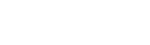<br>
For a given trajectory, ESCHER samples from the opponent's current strategy when it is their turn, but samples from a fixed strategy that roughly visits each information set equally likely when it is the player's turn. Consequently, the expected value of any history value is equal to the counterfactual value scaled by a weighting term based on the fixed sampling policy. Even though some information sets are weighted more than others, the average regret is still guaranteed to converge to zero.

The big draw of ESCHER, and what made me choose it over other algorithms, was the orders of magnitude lower amounts of variance. Notably, ESCHER seems to outperform other algorithms like NFSP and DREAM, and these differences become more dramatic as the game scales in size, which is extremely for solving a large game like stud.

ESCHER starts by training a regret network over a memory buffer of information states and targets that come directly from a learned history value function. Unlike Deep CFR and DREAM however, instantaneous regret estimates are estimated solely from the current history value function, instead of using terminal utility and/or sampling probabilities. A second buffer stores histories and terminal utilities, and these are used to train the aforementioned value network to estimate expected utility of both players for a given history. A third buffer then stores information states and actions taken by the policy _π_ and uses that data to actually train the average policy network, and it is this network that has no regret and converges to an approximate Nash equilibrium.

## Coding Stud

I built my Seven Card Stud environment using OpenSpiel, which is a framework for reinforcement learning developed by Google Deepmind. McAleer's ESCHER implementation had used OpenSpiel in testing, so it felt more natural to also use it for my game environment. I built my environment from a base implementation of Kuhn Poker, a simple Poker variant used in RL experiments. Most of the coding needed was extending the Poker logic to a much larger game. Stud needed a way to evaluate hands early to determine the order to act, and needed to be able to measure multiple streets/rounds of betting. One of the interesting challenges was how to efficiently represent the cards and give proper information to the MLP.

For representing the cards, I tried two approaches: The first approach was to use a one-hot vector for each card. This approach was simplistic and followed from the base implementation of Kuhn Poker which i built on top of. However in practice, it performed poorly in training. I think the sheer size of the input vector (nearly 800 units for a full information tensor) results in weak activations, which manifested in the model as most inputs mapping to the same probability distribution. The second approach i took was a rank/suit approach, where each card was represented in a 17-unit vector, the first 13 for the rank, and the last four for the suit. I'm still in the process of evaluating this approach, but at the moment it seems to be performing well. I think the model will have an easier time drawing relationships between ranks and suits of hands, and I get the added benefit of a much smaller tensor, which allows me to store more examples in my memory buffers during training.

For the betting structure, i used a blind structure of [1, 2, 8, 16]: A 1-chip ante, 2-chip bring-in, 8-chip small-bet/complete, and 16-chip big bet. Sometimes in cash games these proportions can be slightly different, such as the bring-in being 1/5 of the small-bet, but I selected these numbers since they were cleaner and easier to calculate. I gave each player 1000 chips to start with, but since the maximum amount you can wager on a single hand is much less than this, it has no impact on the bot's decision making (there isn't an "all-in" action for the bot to select).

## Training, Hyperparameters

When it came to training the agent, I tried not to mess with the hyperparameters too much. I had looked for some articles on experimenting with ESCHER and the main article I found was ["Reevaluating Policy Gradient Methods for Imperfect-Information
Games" by Rudolph et al.](https://arxiv.org/pdf/2502.08938), which examined the performance of policy-based gradient methods in comparison to CFR-based methods like ESCHER. I used the default parameters from McAleer's github implementation in conjunction with the parameters from Rudolph's paper to start, and adjusted accordingly. Rudolph used a 3-layer 512-hidden unit fully connected network, and given the size of my input vector, I opted to keep this size instead of using something smaller. One adjustment I also made was increasing the number of traversals for the policy, as I figured with a game as large as Seven Card Stud, it would be beneficial for the policy to have more examples to train with. I also used training steps for all nets, mainly since I was constrained for time, and because the for the batch size I was using, I figured I would cover all of the examples in the buffers pretty quickly.

The hyperparameters I generated policies with are listed below:

```
iters = 1000
num_traversals = 5000
num_val_fn_traversals = 2500
regret_train_steps = 5000
val_train_steps = 5000
policy_net_train_steps = 10000
batch_size_regret = 2048
batch_size_val = 2048
batch_size_pol = 2048
learning_rate= 0.001
memory_capacity = 3_000_000
```
If you have the memory to do so, I think a larger buffer tends to perform better for games with a higher number of states. For example, Brown's Deep CFR implementation allocates space for 40 million information sets. 

## Results (so far)

As of now, I am still running the algorithm seeing whether or not I can get better policies out of my model. But what I have so far seems promising. All of the nets i've generated so far have had three hidden layers of 512 units, but a different number of units or hidden layers may be more optimal.

I made a visualizer of sorts that allows you to view a range chart for a given position for either player. One thing I'd note is that I haven't yet added pruning to the range chart yet. What I mean by that is that hands that would've folded earlier in the game will still be evaluated by the chart, so some of the distributions for hands may not make a whole lot of sense (e.g. the bot may not give good advice for a hand like 27 | J43 vs. ?? | AAK since that hand would've most likely folded on third or fourth street).

One of the challenging components was how to handle the river. Range charts for Texas Hold'em don't have this problem since a player only ever has two hole cards, but in stud, a player will have three hole cards by the end. My current solution is to just condition on your hole card, instead of trying to create some sort of crazy 3-dimensional chart. By seventh street the focus is more on whether or not to bet/call anyway so that's what i focused on when designing the chart.

The range chart is made using matplotlib/seaborn. It's technically thirteen subplots stitched together, and there's a legend on the side telling you which hands are which. The top right of the chart is for suited hands, and the bottom left for unsuited hands. On the left side above and below the legend show the hole cards for each player. There will be a blue arrow under the cards of the player whose turn it is to act.

Here are a few example ranges from the best policy i've generated so far:

### Comparison to Professional Play

#### 1. Nguyen vs. Lindgren - 2008 W.S.O.P. H.O.R.S.E.
This hand comes from the 2008 W.S.O.P. H.O.R.S.E. Event, a five-game event that consists of Limit Hold'em, Omaha8, Seven-card stud, Razz, and Stud8. The hand in question is deep into the tournament, with three players remaining. Scotty Nguyen holds the larger stack, and Erick Lindgren is down to only a few blinds left. Michael DeMichele is the middle stack and folds a 5♠

Third street comes:<br>
(Nguyen)  (Lindgren)<br>
9♥8♠ 9♠ - A♠8♥ 8♣<br>
* Lindgren completes
* Nguyen raises
* Lindgren calls

Fourth street comes:<br>
9♥8♠ 9♠Q♥ - A♠8♥ 8♣7♥<br>
* Nguyen bets
* Lindgren calls

Fifth street comes:<br>
9♥8♠ 9♠Q♥2♣ - A♠8♥ 8♣7♥K♠<br>
* Lindgren bets
* Nguyen raises
* Lindgren calls (all in)
* _fin_

Lindgren ends up losing with a worse pair, and Scotty goes heads up against DeMichele to win the bracelet.

In this hand, Lindgren is in a tough position being the short stack of this table. He doesn't have enough chips to go the full distance without going all in, so he had to pick his spot, and the cards just weren't in his favor. My bot doesn't take into account stack sizes, as it assumes both players have equal chips, but I think this hand is still interesting to examine, given both player's hands share common ranks, with Scotty holding ones of the case 8s that Lindgren needed.

Here's how my agent evaluates the situation traversing the history that Nguyen and Lindgren took:

<br>
(Lindgren's Turn) For most hands, the agent chooses to just bring it in instead of paying a larger blind upfront. This makes sense, though notably, there is a noticable increase in completes for the 8/9/T columns and rows, which suggest that drawing hands are more willing to start with a larger bet sizing. I imagine that the fact that Scotty has a 9 up exacerbates this; If Lindgren has cards like 8/9/T in the hole, he is essentially making his hand more valuable while also taking away cards that Scotty would need to make improve his hand. Unfortunately in this case, Lindgren has A8 in the hole, which completes 10-15% of the time.
<br>
(Scotty's Turn) Scotty is essentially going to call with his entire range, save for bad 2X hands and some JX hands for whatever reason. Having a hand like 98o in the hole is extremely valuable here as it blocks one of the case 8's that Lindgren could improve with, as well as reducing his straight-draw odds. You wouldn't want to complete here and risk your opponent folding, so the bot would opt to call and let Lindgren try to catch up on future streets. In the actual hand however, Scotty chooses to raise, for good reason, as he is forcing Lindgren to commit to a hand he already blocks the outs of. Lindgren is in zugzwang essentially, as he either has to give up his complete, or fully commit to the hand as his stack size is already dwindling.

*A note:* Since the bot's actions and the hand's actions diverge here, the agent's decisions tend to become noisier as it is trying to come up with a probability distribution over a state in which it would be unlikely to visit.
<br>
(Lindgren's Turn) Facing a raise, the agent opts to continue the aggression, re-raising in nearly all scenarios. The 8/9/T section of the range chart is most aggresive, mainly due to the blocking effect that 8's 9's and T's give to Lindgren's hand. I'm not sure I agree with how the bot would play here, but it's not entirely uncommon for heads up opponents to get into "raise-offs" early to try and build a pot early.
<br>
(Scotty's Turn) The bot chooses to take an aggresive line with the Queen, betting out with nearly all hands. I find this to be strange considering that Lindgren's drawing hands just improved significantly by catching a 7 on fourth street, but with two overcards you can represent a lot, and hands like JT in the hole can be scary as they would discount any straights that an 87 could make.
<br>
(Lindgren's Turn) The bot chooses to mostly play in flow in response to a raise. Its standard practice in poker to let the preflop aggressor (whoever raised last) do the postflop betting, and calling is a very normal response here. I find it interesting that nearly no hands are folding here, but it's important to note that this range chart tends to be inaccurate for hands that would've folded out earlier, so some of the bottom sections of the range (2X, etc.) aren't very accurate. It's also likely that these hands are "priced-in" to calling, as the pot odds of a call are more than enough to call, even with terrible hands that would need to catch very specific cards to improve.
<br>
(Lindgren's Turn) After catching a King, K87 opens the action, and chooses to raise here most of the time, although is checking slightly more often than it was on fourth street. The big bet kicks in on fifth street, meaning that betting is twice as large as it was on previous streets.
<br>
(Scotty's Turn) In response to a bet, Scotty calls with his entire range. This sort of response seems odd, but I figure that trying to keep the pot small is the bot's way of reducing regret without folding. Catching a 2 is probably the worst card Scotty could have gotten, and while we know he has a pair of nines at this moment, Lindgren's range is much better connected.

It's at this point where Lindgren goes all in so I conclude the analysis here, but its very interesting seeing how the bot would choose to play a real hand.

## Conclusions

After working on this project for the past several months, I think I'd consider it a partial success. Having tested older policies against newer ones, I was able to demonstrate ESCHER's ability to improve upon older policies, even if the improvements were relatively slow. I think that experimenting with different hyperparameters could definitely lead to better results, but the search space you would need to cover would be quite large, and I unfortunately don't have the time or compute available to check. The time constraint is the largest, as I coded the game environment in Python so generating trajectories is orders of magnitude slower than it could be. If I had the time and experience, programming the environment in C++ which OpenSpiel better supports would be preferable.

I think I had decent enough compute for escher to work, but if I had more resources, I would make buffers significantly larger, about 10<sup>8</sup> entries or larger. I would also make batch sizes larger as well, probably around 50-100 thousand per update to compensate for the extreme branching nature of stud. There is also definitely more to be explored for optimal hyperparameters. One of the issues that ESCHER suffers from is that their is such a large number of hyperparameters that it becomes difficult to find an optimal selection to start from (Rudolph makes mention of this). Ensuring that the value network properly converges is crucial, as it is the value network that gives the target values for the regret network.

As for my questions going in, I'm not sure if I ever got definitive answers to any of them. My network hasn't yet been able to perform at a level on par with a human yet, but I'm glad that it was at least able to iteratively improve. Perhaps a different algorithm/approach such as a policy-based method like PPO or MMD would perform better. I will say that for Question #2, i think the consensus is that calling on later streets is justified, at least the preliminary policies generated seem to suggest that. 

For my first RL project I think this was quite ambitious, but I enjoyed the process of trying to learn and decipher the papers I was reading. There was a lot of revisiting and rereading involved, but I think through that process I was able to better understand what I was doing, and improve my programming skills further than had I done something simpler. Plus, it was something I had a personal interest in.

Thanks for reading through, if you have any comments or questions, feel free to send me an email.

## Citations, Codebases, etc.

Papers Used:

https://mlanctot.info/files/papers/PhD_Thesis_MarcLanctot.pdf

https://proceedings.mlr.press/v97/brown19b/brown19b.pdf

https://arxiv.org/pdf/2206.04122

https://www.youtube.com/watch?v=8QyU4Lc42S8&t=2200s

https://arxiv.org/pdf/1811.00164 with proofs and code

https://github.com/Sandholm-Lab/ESCHER/

https://arxiv.org/pdf/2502.08938

http://reports-archive.adm.cs.cmu.edu/anon/2020/CMU-CS-20-132.pdf

https://arxiv.org/pdf/1907.09633

https://www.youtube.com/watch?v=8QyU4Lc42S8&t=1286s
